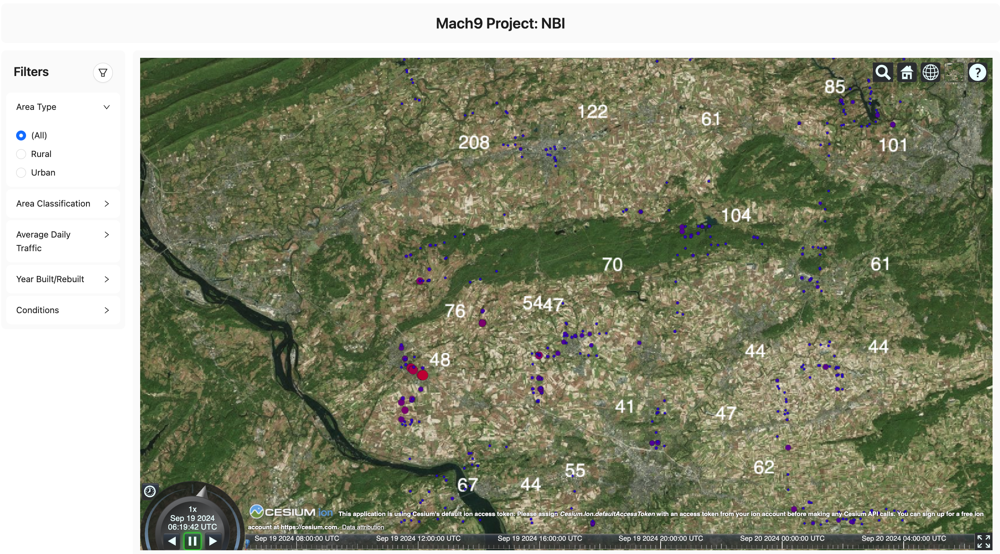

# Mach9: National Bridge Inventory


## Overview

This project is organized into three main components:
- **API**: The backend server using Apollo GraphQL.
- **Client**: The frontend application built with React.
- **Scripts**: Utility scripts for data conversion and extraction to the API folder.

## Folder Structure

- **api**: Contains the backend server and GraphQL API implementation.
- **client**: Contains the frontend application and related code.
- **scripts**: Contains scripts for data processing.

## Getting Started

### Prerequisites

- [Node.js](https://nodejs.org/) (v20 or higher)
- [npm](https://www.npmjs.com/) (v10 or higher)

### Setup

#### 1. API Server

i. Navigate to the `api` folder:
   ```bash
   cd api
   ```

ii. Install dependencies:
   ```bash
   npm install
   ```

iii. Start the API server:
   ```bash
   npm run start
   ```

   The API server will run on [http://localhost:4000](http://localhost:4000) by default.

#### 2. Client Application

i. Navigate to the `client` folder:
   ```bash
   cd client
   ```

i. Install dependencies:
   ```bash
   npm install
   ```

iii. Start the development server:
   ```bash
   npm run dev
   ```

   The client application will run on [http://localhost:5173/](http://localhost:5173/) by default.

#### 3. Scripts

i. Navigate to the `scripts` folder:
   ```bash
   cd scripts
   ```

ii. Run the desired script to convert or extract data:
   ```bash
   npm run <script-name>
   ```

   Replace `<script-name>` with the specific script command such as `readCSV.js`.

## Configuration

- Ensure that the API server and client are properly configured to communicate with each other.
- Update environment variables and configuration files as needed.


## License

This project is licensed under the MIT License - see the [LICENSE](LICENSE) file for details.


## References
- [The National Bridge Inventory database - Center for Automotive Research at Stanford](https://cars.stanford.edu/datadriven/national-bridge-inventory-database)
- [Visualization for National Bridge Inventory Data](https://ncrst.charlotte.edu/applications/visualization-national-bridge-inventory-data/)
- [The US Bridge Portal -Visualization Analytics Applications for the National Bridge Inventory (NBI) Database](https://www.internationaljournalssrg.org/IJCE/paper-details?Id=69)

## ChatGPT transcripts
- [NBI Data Column Overview](https://chatgpt.com/share/66ebc055-69ac-800e-a5b0-c500952bd12c)
- [Adding Bridge Data GraphQL](https://chatgpt.com/share/66ebc0e9-0efc-800e-b443-a198485ea7a7)
- [Organize Index.ts File](https://chatgpt.com/share/66ebc121-1498-800e-b5b5-d23975e0c6e6)
- [Convert Object to Array](https://chatgpt.com/share/66ebc165-44fc-800e-ab55-4689ebbd0a62)
- [Function Annotation Help](https://chatgpt.com/share/66ebc187-7a28-800e-858a-ab49cdf1fcec)
- [Project README Creation](https://chatgpt.com/share/66ebc2e6-ad34-800e-a1b9-f6379866711f)


